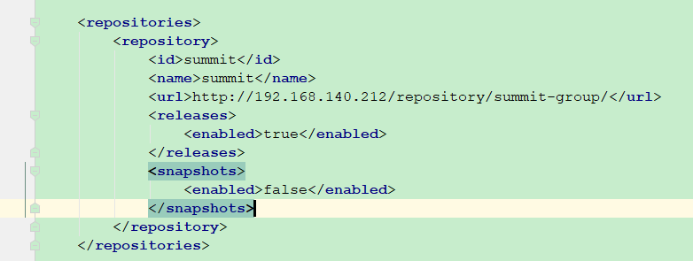
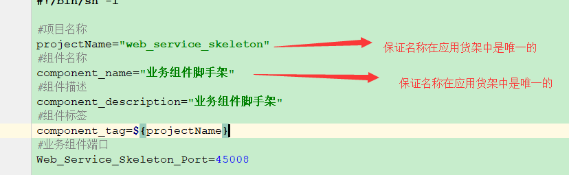
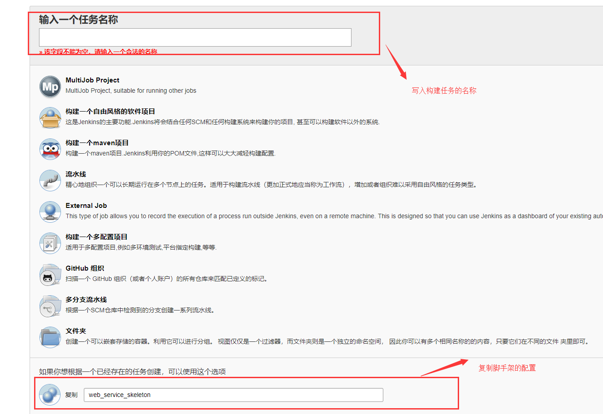
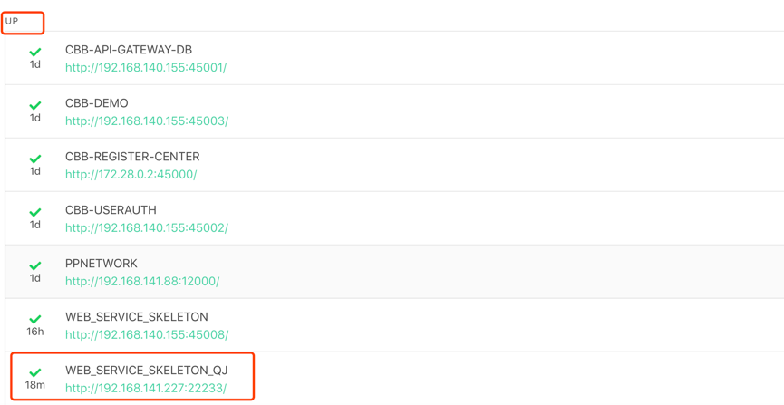
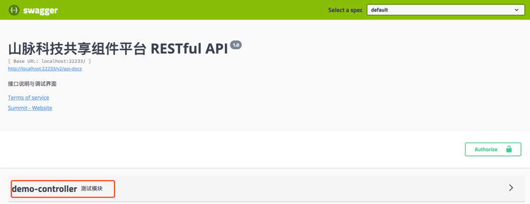

# 山脉科技业务组件脚手架

- [山脉科技业务组件脚手架](#山脉科技业务组件脚手架)
    - [业务组件脚手架Swagger访问地址(线上)](#业务组件脚手架swagger访问地址线上)
    - [开发环境](#开发环境)
    - [工程结构](#工程结构)
    - [关于依赖共享组件common包的注意事项:](#关于依赖共享组件common包的注意事项:)
    - [组件名称命名规范](#组件名称命名规范)
    - [关于业务组件发布到应用货架的注意事项:](#关于业务组件发布到应用货架的注意事项:)
    - [开发流程](#开发流程)
        - [切换环境](#切换环境)
        - [编译](#编译)
        - [启动](#启动)
        - [开发](#开发)
            - [配置文件](#配置文件)
            - [源码](#源码)
            - [部署脚本](#部署脚本)

## 业务组件脚手架Swagger访问地址(线上)

<http://192.168.140.155:45008/swagger-ui.html>

## 开发环境
- git
- jdk 1.8+
- maven 3.2+
- redis 3.2+
- mysql 5.7+
- IDE Idea&Eclipse
- lombok

## 工程结构
```
web_service_skeleton
├── deploy    --部署生产环境相关脚本目录
├── env       --生产环境的环境变量存储文件夹
├── src       --源码目录
│ └── main
│         ├── java
│         │    └── com.summit
│         │         └── MainAction.java --骨架启动类
│         └── resources
│              ├── db                    --flyway管理的sql脚本
│              ├── application.yml       --公共变量配置文件
│              ├── application-dev.yml   --开发环境配置文件
│              ├── application-pro.yml   --生产环境配置文件
│              └── logback.xml           --日志配置文件
│               └── mybatis-config.xml    --mybatis配置文件
├── .dockerignore    -- 构建Docker镜像时复制文件的忽略文件清单
├── Dockerfile       -- 构建Docker镜像脚本
└── pom.xml          -- maven配置文件
```

## 关于依赖共享组件common包的注意事项:

- 共享组件common包所在的maven中央仓库地址如下图：开发脚手架已经在pom中配置完成，下图仅供参考：

    

## 组件名称命名规范

- 配置组件中的`application.yml`配置文件:

  组件名称以`cbb-`开头，后缀以具体组件的用途的英文全拼或缩写命名，注意：用缩写的前提是必须是有明确意义的缩写

  ``` yml
    spring:
        application:
          name: "cbb-web-service-skeleton" -- 分隔符必须用'-'
  ```

- 配置组件中的`deploy/jenkins_build.sh`部署脚本:

  组件名称以`cbb_`开头,后缀以具体组件的用途的英文全拼或缩写命名，注意：用缩写的前提是必须是有明确意义的缩写

  ``` sh
    #项目名称
    projectName="cbb_web_service_skeleton" -- 分隔符必须用'_'(下划线)，并且要保证该组件名称与共享货架中的组件不冲突
    #组件名称
    component_name="业务组件脚手架"  --并且要保证该组件名称与共享货架中的组件不冲突
    #组件描述
    component_description="业务组件脚手架"
    #组件标签
    component_tag=${projectName}
  ```


## 关于业务组件发布到应用货架的注意事项:

- 配置构建脚本：
  在你的组件中的`deploy/jenkins_build.sh`文件中，如图：

  

- 每个业务组件需要在`192.168.140.155:6333`这台服务器的CI系统上创建一个自己的构建任务,创建构建任务的步骤：
  - 第一步：
    
  - 第二步，复制脚手架配置，然后点击确定：
    
  - 第三步,更换仓库地址,然后点击保存：
    

- 如下图创建的是一个业务组件脚手架的构建任务：

    

## 开发流程

### 切换环境

- 切换到开发环境模式配置文件，需要配置组件中的`application.yml`配置文件
    ``` yml
    spring:
      profiles:
        active: dev
    ```
- 修改应用程序的名称
    ``` yml
    spring:
      application:
        name: "web_service_skeleton" --此处用应用程序开发模板作为例子
    ```
  备注：为了防止在开发环境中的冲突问题，应用程序的名称做个规定:项目名称_自己名字缩写，比如：<font color=#FF0000>web_service_skeleton_qj</font>

### 编译

``` shell
  cd web_service_skeleton

  mvn clean install
```

构建完成，生成target目录，目录结构如下图

```
   target
   ├── classes
   ├── config      -- 配置文件打包的位置
   ├── generated-sources
   ├── lib         -- 打包之后所依赖的jar包
   ├── maven-archiver
   ├── maven-status
   └── backend.jar  --打包后的jar包
```

### 启动

- 运行 `MainAction.java` 即可

- 启动完成后访问<http://192.168.140.155:45000/admin>，用户名和密码为：

  ``` yml
      用户名:ucp
      密码:Summit2018
  ```

- 在访问页面出现注册的服务为<font color=green size=5px> up</font>，即启动成功，如下图所示：

  

- 访问<http://localhost:22233/swagger-ui.html>，即可调试接口,如下图所示

  

### 开发

#### 配置文件

- 将`application-dev.yml`的数据库切换为自己的业务库

  ```yml
  spring:
    datasource:
      driver-class-name: com.mysql.jdbc.Driver
        jdbc:mysql://192.168.140.155:49999/web_service_skeleton?createDatabaseIfNotExist=true&useSSL=false&useUnicode=yes&characterEncoding=UTF-8
        username: root  --用户名
        password: Summit2017 --密码
  ```

- 开发环境和线上环境一致的属性配置在`application.yml`中，开发环境和线上环境不一致的属性配置在`application-dev.yml`和`application-pro.yml`中

#### 源码

```
com.summit
 ├──config                   -- 配置类所在包
 ├── controller              -- 控制层所在包
 ├── dao                     -- 持久层所在包
 ├── domain                  -- pojo所在包
 ├── hystric                 -- 组件之间接口调用异常熔断处理包
 ├── service                 -- 业务层所在包
 └── MainAction.java         -- 核心启动类
```

#### 部署脚本

将服务部署在公司服务器(192.168.140.155)上时，需要修改两个文件：

- `jenkins_build.sh`

  ``` sh
  #项目名称
  projectName="web_service_skeleton" --修改为自己业务工程的项目名称
  ```
  

- `env.sh`

  ``` sh
  #!/bin/sh -l
  #此处用于存放公共变量

  #注册中心端口
  Registry_Center_Port=45000
  #Demo端口
  Web_Service_Skeleton_Port=45008   --此端口修改为没有占用的端口
  ```
